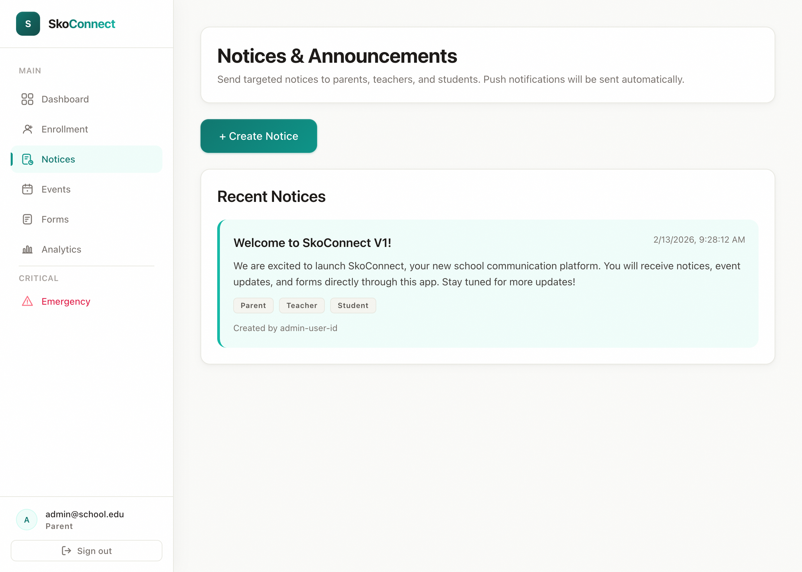

# SkoConnect Documentation — Style Guide

> SkoConnect Documentation v1.0 | Last updated: 2026-04-01

---

## Voice and Tone

SkoConnect documentation should feel like a friendly colleague walking you through something new — not a textbook, not a robot, and definitely not someone talking down to you.

**Be direct and conversational.** Use "you" and "your" to address the reader. Write the way you'd explain something to a coworker who's never used the platform before.

**Show empathy.** People get frustrated with new tools. Acknowledge that and offer reassurance.

> Don't worry if you make a mistake — you can always go back and edit later. Nothing is permanent until you hit **Save**.

**Encourage exploration.** Give readers the confidence to try things on their own.

> Try it out! Create a test notice, send it to yourself, and see how it looks on your phone. The best way to learn is by doing.

**Reading level: 8th grade.** Short sentences. Simple words. One idea per paragraph. If a sentence runs longer than two lines, break it up.

---

## Formatting Rules

### Headings
- **H2 (`##`)** — Major sections (Overview, Getting Started, Troubleshooting, FAQ)
- **H3 (`###`)** — Subsections or specific procedures
- Never skip heading levels (don't go from H2 to H4)

### Step-by-Step Instructions
Use numbered lists for any procedure a user needs to follow:

1. Open the **Notices** page from the sidebar
2. Click the **Create Notice** button in the top-right corner
3. Fill in the notice title and description
4. Choose your target audience
5. Click **Send**

### UI Elements
Use **bold** for any button, tab, field, or menu item the user needs to interact with:

- Click the **Save** button
- Navigate to the **Events** tab
- Enter your email in the **Email** field

### Code Blocks
Use code blocks (` ``` `) ONLY for things the user types or sees as text:

```
admin@school.edu
https://school-connect-enterprise.web.app
```

Do NOT use code blocks for descriptions, explanations, or prose.

### Blockquotes
Use `>` blockquotes for tips, warnings, and important notes:

> **Tip:** You can target notices to specific grade levels — parents only see notices relevant to their children.

> **Important:** Emergency broadcasts cannot be edited after sending. Double-check your message before you click **Send**.

### Horizontal Rules
Use `---` to separate major sections within a document. Don't overuse them — one every few sections is enough.

### Tables
Use tables for comparisons, role permissions, or any content with parallel structure:

| Feature | Admin | Teacher | Parent |
|---------|-------|---------|--------|
| Create notices | ✅ | ✅ | ❌ |
| View events | ✅ | ✅ | ✅ |
| Manage users | ✅ | ❌ | ❌ |

---

## Screenshot Standards

### When to Include Screenshots
Include a screenshot every 3-5 steps in procedural content. Screenshots break up text and give users a visual anchor.

### Format
```

```

### Alt Text Format
Always describe what the user is looking at:

```

```

Pattern: `Screenshot of [page name] showing [key element being described]`

### Surrounding Text
Every screenshot needs context — text BEFORE it (what you're looking at) and text AFTER it (what to do next):

1. Click **Create Notice** in the top-right corner
2. You'll see the notice creation form:

   

3. Fill in the **Title** field with a clear subject line
4. Write your notice content in the **Description** field

---

## Cross-Reference Format

When pointing readers to another guide, use this format:

```
→ See [Admin Quick Start Guide](guides/admin-quick-start.md)
→ For details, see [Digital Forms Deep-Dive](deep-dives/digital-forms.md)
```

Always use relative paths from the repository root. Never use absolute URLs or file paths.

---

## Document Structure

Every guide must follow this structure:

```
> SkoConnect Documentation v1.0 | Last updated: [date]

# [Guide Title]

## Overview
[2-3 sentences: what this guide covers, who it's for, how long it takes]

## Prerequisites
[What the user needs before starting]

## [Section 1]
[Step-by-step instructions with screenshots]

## [Section 2]
[Step-by-step instructions with screenshots]

## [Additional sections as needed]

## Troubleshooting
[5+ common issues with clear solutions]

## FAQ
[5+ questions and answers specific to this guide]

## Related Guides
→ See [Guide Name](path.md)
```

### Section Guidelines
- **Overview**: 2-3 sentences max. Answer: what is this, who is it for, why should I read it?
- **Prerequisites**: Bullet list of what's needed (account, app, permissions)
- **Procedures**: Numbered steps with bold UI elements and screenshots
- **Troubleshooting**: Table format (Problem | Solution) with 5+ entries
- **FAQ**: Question in bold, answer in plain text. 5+ entries minimum.

---

## Accessibility

- **Alt text** on every image — describe what the image shows
- **Descriptive link text** — never use "click here" or "read more"
- **Heading hierarchy** — don't skip levels (H2 → H4 is wrong)
- **Tables** — include header rows and keep them simple

---

## Forbidden Words and Phrases

These words make readers feel stupid, dismissed, or overwhelmed. Do NOT use them in any documentation.

| Word/Phrase | Why It's a Problem | Use Instead |
|------------|-------------------|-------------|
| simply | Implies the task is trivial (it may not be for the reader) | follow these steps |
| just | Dismisses complexity | here's how |
| obviously | Makes readers feel dumb if it wasn't obvious | as you can see |
| easy | May not be easy for the reader | straightforward |
| basically | Vague and adds no meaning | specifically |
| needless to say | Condescending — if it's needless, don't say it | (remove entirely) |
| simply put | Condescending | in other words |
| it's that simple | Dismissive | once you know the steps |
| as you might expect | Assumes knowledge the reader may not have | here's what happens |
| self-explanatory | Dismissive — nothing is truly self-explanatory | here's how it works |
| should be obvious | Condescending | here's what to look for |
| it goes without saying | Condescending — then don't say it | (remove entirely) |
| all you need to do | Minimizes what may be a complex task | here are the steps |
| a piece of cake | Condescending | (remove entirely) |

---

## Version Note

Every guide MUST start with this line at the very top:

```
> SkoConnect Documentation v1.0 | Last updated: [date]
```

The date should be the date the guide was last reviewed or updated.

---

## Sample: Welcome to SkoConnect

Welcome to SkoConnect — your school's new home for communication. This guide will walk you through everything you need to get started, whether you're a school administrator setting up the platform, a teacher sending your first notice, or a parent checking your child's calendar.

If you're brand new here, start with the **Quick Start Guide** for your role. Each guide takes just a few minutes to read and will have you up and running before your next coffee break. If you run into any questions along the way, check the **FAQ** at the bottom of any guide — chances are someone else had the same question.

> **Tip:** Bookmark this documentation page so you can come back to it anytime. You don't need to memorize everything — that's what these guides are for.
